Survival Analysis And Visualization
================
노혜림
2020 9 5

# Survival Analysis And Visualization

## 요약

### (1) 전처리

  - 결측 값 BMI 2, TOT\_CHOLE 2, SMK\_STAT\_TYPE\_RSPS\_CD 365,
    DRNK\_HABIT\_RSPS\_CD 105, EXERCI\_FREQ\_RSPS\_CD 111개가 있으며,
    2002\~2006년의 검진 자료를 이용해 결측 값 대체하였다.
  - 이 전 건강검진 기록이 존재하지 않는 SMK\_STAT\_TYPE\_RSPS\_CD 6개,
    DRNK\_HABIT\_RSPS\_CD 1개는 분석에서 제외되어, 6632 row 사용 **(time-depedent 셋
    기준 6638-\>6632)**
  - 아래 기초통계량은 사람 기준으로 출력 (결측 4개 제외되어, 5636-\>5632)
  - 우선) BMI (30 이상 1, 미만 0), AGE (65 이상 1, 미만 0), TOT\_CHOLE (220 이상 1,
    미만 0), DRNK\_HABIT\_RSPS\_CD (4 이상 1, 미만 0),
    EXERCI\_FREQ\_RSPS\_CD (4 이상 1, 미만 0)

### (2) 결과 요약

  - 맨 뒤에 그래프 및 표 확인

| NO. | Method           | Correction                | HR    | 95% Lower | 95% Upper | p-value |
| --- | ---------------- | ------------------------- | ----- | --------- | --------- | ------- |
| 1   | Time-fixed Cox   | X                         | 1.771 | 1.389     | 2.257     | \*\*\*  |
| 2   | Time-Varying Cox | X                         | 3.981 | 3.076     | 5.152     | \*\*\*  |
| 3   | Time-Varying Cox | AGE, SEX, Income          | 3.25  | 2.499     | 4.226     | \*\*\*  |
| 4   | Time-Varying Cox | AGE, SEX, Income, GJ      | 3.07  | 2.356     | 4         | \*\*\*  |
| 5   | Time-Varying Cox | CCI                       | 3.03  | 2.329     | 3.492     | \*\*\*  |
| 6   | Time-Varying Cox | CCI, AGE, SEX, Income     | 2.677 | 2.052     | 3.492     | \*\*\*  |
| 7   | Time-Varying Cox | CCI, AGE, SEX, Income, GJ | 2.563 | 1.961     | 3.35      | \*\*\*  |
| 8   | Time-Varying Cox | All (+HTN, DM, DL)        | 2.298 | 1.749     | 3.02      | \*\*\*  |

## 0\. Preparation

### Load Library

### Load Data

### 결측 대체

    ##             PERSON_ID                   BMI             TOT_CHOLE 
    ##                     0                     2                     2 
    ## SMK_STAT_TYPE_RSPS_CD    DRNK_HABIT_RSPS_CD   EXERCI_FREQ_RSPS_CD 
    ##                   365                   105                   111 
    ##                CVD_DT            Aspirin_DT                   CVD 
    ##                     0                     0                     0 
    ##               Aspirin              INDEX_DT                  FUDT 
    ##                     0                     0                     0 
    ##                   SEX                   AGE       CTRB_PT_TYPE_CD 
    ##                     0                     0                     0 
    ##              CCI_orig                   HTN                    DM 
    ##                     0                     0                     0 
    ##                    DL                 START                  STOP 
    ##                     0                     0                     0 
    ##              Aspirin1                  CVD1 
    ##                     0                     0

    ## size match X

    ## size match X

    ## size match X

    ##             PERSON_ID                   BMI             TOT_CHOLE 
    ##                     0                     0                     0 
    ## SMK_STAT_TYPE_RSPS_CD    DRNK_HABIT_RSPS_CD   EXERCI_FREQ_RSPS_CD 
    ##                     6                     1                     0 
    ##                CVD_DT            Aspirin_DT                   CVD 
    ##                     0                     0                     0 
    ##               Aspirin              INDEX_DT                  FUDT 
    ##                     0                     0                     0 
    ##                   SEX                   AGE       CTRB_PT_TYPE_CD 
    ##                     0                     0                     0 
    ##              CCI_orig                   HTN                    DM 
    ##                     0                     0                     0 
    ##                    DL                 START                  STOP 
    ##                     0                     0                     0 
    ##              Aspirin1                  CVD1 
    ##                     0                     0

    ## [1] 6632

### 전처리

    ## 'data.frame':    6632 obs. of  23 variables:
    ##  $ PERSON_ID            : num  10215391 10221780 10262333 10274163 10305844 ...
    ##  $ BMI                  : chr  "22.98" "22.1" "20.33" "20.92" ...
    ##  $ TOT_CHOLE            : chr  "205" "163" "271" "208" ...
    ##  $ SMK_STAT_TYPE_RSPS_CD: num  1 1 1 1 2 2 3 3 1 1 ...
    ##  $ DRNK_HABIT_RSPS_CD   : num  2 1 1 1 3 3 4 4 1 1 ...
    ##  $ EXERCI_FREQ_RSPS_CD  : num  1 1 1 1 1 1 1 1 1 1 ...
    ##  $ CVD_DT               : chr  "." "." "." "39814" ...
    ##  $ Aspirin_DT           : chr  "." "." "." "." ...
    ##  $ CVD                  : num  0 0 0 1 0 0 0 0 0 0 ...
    ##  $ Aspirin              : num  0 0 0 0 1 1 1 1 0 0 ...
    ##  $ INDEX_DT             : POSIXct, format: "2008-05-20" "2007-07-13" ...
    ##  $ FUDT                 : POSIXct, format: "2013-12-31" "2011-01-22" ...
    ##  $ SEX                  : num  2 1 2 2 1 1 1 1 1 1 ...
    ##  $ AGE                  : num  84 84 83 83 83 83 83 83 83 83 ...
    ##  $ CTRB_PT_TYPE_CD      : num  5 10 2 4 8 8 2 2 1 3 ...
    ##  $ CCI_orig             : num  1 0 0 4 3 3 4 4 1 0 ...
    ##  $ HTN                  : num  0 0 1 1 1 1 1 1 0 0 ...
    ##  $ DM                   : num  0 0 1 1 0 0 0 0 0 1 ...
    ##  $ DL                   : num  0 0 0 0 0 0 0 0 0 0 ...
    ##  $ START                : num  0 0 0 0 0 ...
    ##  $ STOP                 : num  2051 1289 796 138 1073 ...
    ##  $ Aspirin1             : num  0 0 0 0 0 1 0 1 0 0 ...
    ##  $ CVD1                 : num  0 0 0 1 0 0 0 0 0 0 ...

### 기초통계량

    ## 
    ##            Descriptive Statistics by 'Aspirin'           
    ## __________________________________________________________ 
    ##                                 0            1         p  
    ##                              (N=4489)     (N=1143)  
    ## ---------------------------------------------------------- 
    ##  AGE                                                 0.000
    ##    - <65                   4080 (90.9%) 902 (78.9%)       
    ##    - >=65                  409 ( 9.1%)  241 (21.1%)       
    ##  SEX                                                 1.000
    ##    - Male                  2815 (62.7%) 717 (62.7%)       
    ##    - Female                1674 (37.3%) 426 (37.3%)       
    ##  Income                                              0.753
    ##    - 0-1                   273 ( 6.1%)   73 ( 6.4%)       
    ##    - 2-10                  4216 (93.9%) 1070 (93.6%)      
    ##  HTN                                                 0.000
    ##    - 0                     3769 (84.0%) 582 (50.9%)       
    ##    - 1                     720 (16.0%)  561 (49.1%)       
    ##  DM                                                  0.000
    ##    - 0                     4030 (89.8%) 845 (73.9%)       
    ##    - 1                     459 (10.2%)  298 (26.1%)       
    ##  DL                                                  0.000
    ##    - 0                     3453 (76.9%) 688 (60.2%)       
    ##    - 1                     1036 (23.1%) 455 (39.8%)       
    ##  BMI                                                 0.000
    ##    - <25                   3164 (70.5%) 640 (56.0%)       
    ##    - >=25                  1325 (29.5%) 503 (44.0%)       
    ##  Cholestrol                                          0.000
    ##    - <220                  3374 (75.2%) 788 (68.9%)       
    ##    - >=220                 1115 (24.8%) 355 (31.1%)       
    ##  Smoke_Status                                        0.220
    ##    - Never Smoked          3022 (67.3%) 771 (67.5%)       
    ##    - Smoked in the past    524 (11.7%)  151 (13.2%)       
    ##    - Currently a smoker    943 (21.0%)  221 (19.3%)       
    ##  Drink_Status                                        0.070
    ##    - Hardly drank          2355 (52.5%) 630 (55.1%)       
    ##    - 2-3 a month           784 (17.5%)  209 (18.3%)       
    ##    - More than once a week 1350 (30.1%) 304 (26.6%)       
    ##  Exercise                                            0.696
    ##    - No                    1956 (43.6%) 506 (44.3%)       
    ##    - Yes                   2533 (56.4%) 637 (55.7%)       
    ##  CCI                                                 0.000
    ##    - 0                     1896 (42.2%) 296 (25.9%)       
    ##    - 1                     1277 (28.4%) 287 (25.1%)       
    ##    - 2                     726 (16.2%)  212 (18.5%)       
    ##    - >=3                   590 (13.1%)  348 (30.4%)       
    ## ----------------------------------------------------------

## 1\. Time Fixed Survival Analysis

``` r
# (1) Naive Model
fixed.fit <- survfit(Surv(TIME, CVD)~Aspirin, data=data.fixed)
ggsurvplot(fixed.fit, 
           risk.table = TRUE, risk.table.col = "strata",
           fun = "cumhaz", palette="nejm",
           legend.labs = c("No Aspirin User", "Aspirin User"), submain="CVD Event with/without Aspirin") +
  theme_survminer(font.submain=c(15, "bold.italic", "black"),
                  font.x = c(14, "bold.italic", "black"),
                  font.y = c(14, "bold.italic", "black"))
```

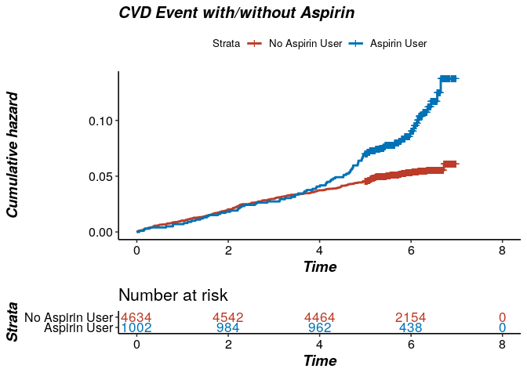<!-- -->

``` r
fixed.cox <- coxph(Surv(TIME, CVD)~Aspirin, data=data.fixed)
summary(fixed.cox)  
```

    ## Call:
    ## coxph(formula = Surv(TIME, CVD) ~ Aspirin, data = data.fixed)
    ## 
    ##   n= 5636, number of events= 326 
    ## 
    ##           coef exp(coef) se(coef)     z Pr(>|z|)    
    ## Aspirin 0.5713    1.7706   0.1239 4.611    4e-06 ***
    ## ---
    ## Signif. codes:  0 '***' 0.001 '**' 0.01 '*' 0.05 '.' 0.1 ' ' 1
    ## 
    ##         exp(coef) exp(-coef) lower .95 upper .95
    ## Aspirin     1.771     0.5648     1.389     2.257
    ## 
    ## Concordance= 0.54  (se = 0.012 )
    ## Likelihood ratio test= 19.37  on 1 df,   p=1e-05
    ## Wald test            = 21.26  on 1 df,   p=4e-06
    ## Score (logrank) test = 21.85  on 1 df,   p=3e-06

``` r
ggforest(fixed.cox,
         main = "CVD Event Hazard Ratio", 
         fontsize = 0.7, 
         refLabel = "reference", 
         noDigits = 2, 
         data=data.dep2)
```

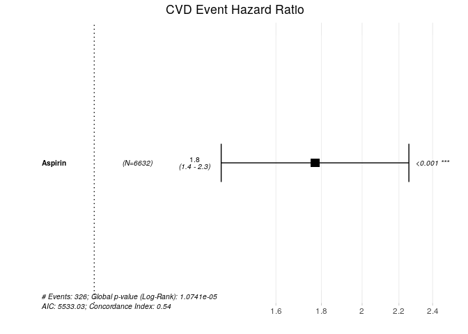<!-- -->

## 2\. Time Dependent Survival Analysis

### 2.1

``` r
dependent.fit <- survfit(Surv(START, STOP, CVD1)~Aspirin1, data=data.dep2)
ggsurvplot(dependent.fit, 
           risk.table = TRUE, risk.table.col = "strata",
           fun = "cumhaz", palette="nejm",
           legend.labs = c("No Aspirin User", "Aspirin User"), submain="CVD Event with/without Aspirin") +
  theme_survminer(font.submain=c(15, "bold.italic", "black"),
                  font.x = c(14, "bold.italic", "black"),
                  font.y = c(14, "bold.italic", "black"))
```

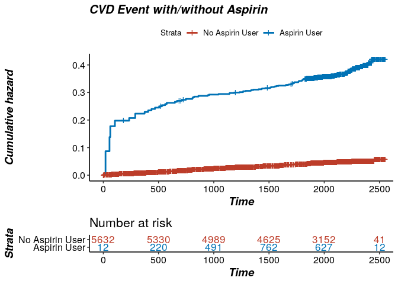<!-- -->

``` r
dependent.cox <- coxph(Surv(START, STOP, CVD1)~Aspirin1, data=data.dep2)

summary(dependent.cox)
```

    ## Call:
    ## coxph(formula = Surv(START, STOP, CVD1) ~ Aspirin1, data = data.dep2)
    ## 
    ##   n= 6632, number of events= 325 
    ## 
    ##            coef exp(coef) se(coef)    z Pr(>|z|)    
    ## Aspirin1 1.3816    3.9812   0.1316 10.5   <2e-16 ***
    ## ---
    ## Signif. codes:  0 '***' 0.001 '**' 0.01 '*' 0.05 '.' 0.1 ' ' 1
    ## 
    ##          exp(coef) exp(-coef) lower .95 upper .95
    ## Aspirin1     3.981     0.2512     3.076     5.152
    ## 
    ## Concordance= 0.583  (se = 0.012 )
    ## Likelihood ratio test= 90.77  on 1 df,   p=<2e-16
    ## Wald test            = 110.3  on 1 df,   p=<2e-16
    ## Score (logrank) test = 127.5  on 1 df,   p=<2e-16

``` r
ggforest(dependent.cox,
         main = "CVD Event Hazard Ratio", 
         fontsize = 0.7, 
         refLabel = "reference", 
         noDigits = 2, 
         data=data.dep2)
```

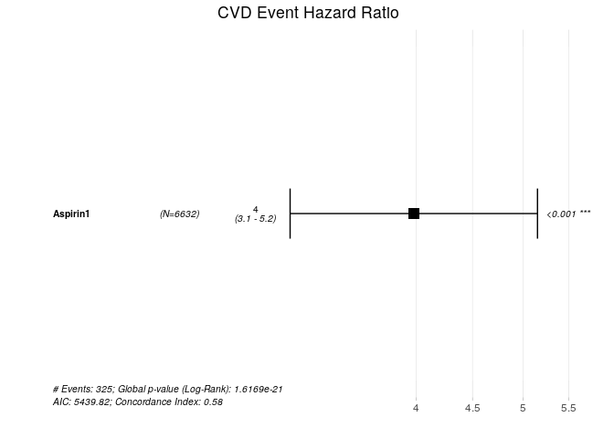<!-- -->

### 2.2 Multi

``` r
#dependent.fit2 <- survfit(Surv(START, STOP, CVD1)~Aspirin1+AGE+SEX, data=data.dep2)
dependent.cox2 <- coxph(Surv(START, STOP, CVD1)~Aspirin1+AGE+SEX+Income, data=data.dep2)

summary(dependent.cox2)
```

    ## Call:
    ## coxph(formula = Surv(START, STOP, CVD1) ~ Aspirin1 + AGE + SEX + 
    ##     Income, data = data.dep2)
    ## 
    ##   n= 6632, number of events= 325 
    ## 
    ##               coef exp(coef) se(coef)      z Pr(>|z|)    
    ## Aspirin1    1.1787    3.2500   0.1340  8.795   <2e-16 ***
    ## AGE>=65     1.2913    3.6376   0.1222 10.571   <2e-16 ***
    ## SEXFemale  -0.1324    0.8760   0.1165 -1.136    0.256    
    ## Income2-10  0.3492    1.4180   0.2441  1.430    0.153    
    ## ---
    ## Signif. codes:  0 '***' 0.001 '**' 0.01 '*' 0.05 '.' 0.1 ' ' 1
    ## 
    ##            exp(coef) exp(-coef) lower .95 upper .95
    ## Aspirin1       3.250     0.3077    2.4993     4.226
    ## AGE>=65        3.638     0.2749    2.8631     4.622
    ## SEXFemale      0.876     1.1415    0.6972     1.101
    ## Income2-10     1.418     0.7052    0.8787     2.288
    ## 
    ## Concordance= 0.679  (se = 0.016 )
    ## Likelihood ratio test= 185.2  on 4 df,   p=<2e-16
    ## Wald test            = 231.2  on 4 df,   p=<2e-16
    ## Score (logrank) test = 271.2  on 4 df,   p=<2e-16

``` r
#ggsurvplot(dependent.fit2, 
#           risk.table = TRUE,  combine = TRUE,
#           fun = "cumhaz", palette="nejm",
#           submain="CVD Event with/without Aspirin") +
#  theme_survminer(font.submain=c(15, "bold.italic", "black"),
#                  font.x = c(14, "bold.italic", "black"),
#                  font.y = c(14, "bold.italic", "black"))

ggforest(dependent.cox2,
         main = "CVD Event Hazard Ratio", 
         fontsize = 0.7, 
         refLabel = "reference", 
         noDigits = 2, 
         data=data.dep2)
```

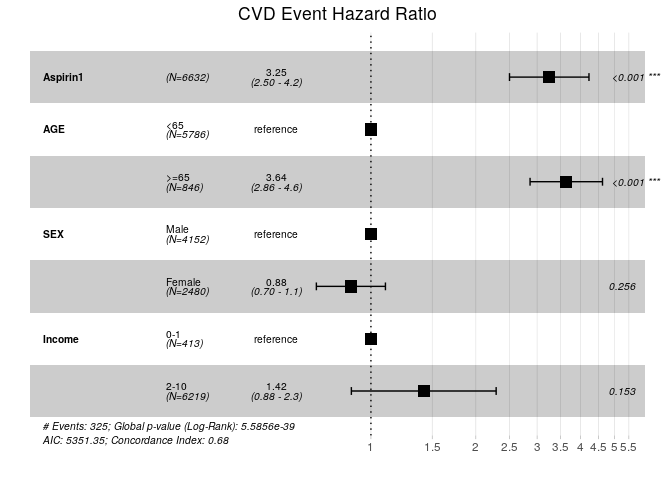<!-- -->

``` r
#dependent.fit2_2 <- survfit(Surv(START, STOP, CVD1)~Aspirin1+AGE+SEX+BMI+Cholestrol+Smoke_Status+Drink_Status+Exercise+Income, data=data.dep2)
dependent.cox2_2 <- coxph(Surv(START, STOP, CVD1)~Aspirin1+AGE+SEX+BMI+Cholestrol+Smoke_Status+Drink_Status+Exercise+Income, data=data.dep2)

summary(dependent.cox2_2)
```

    ## Call:
    ## coxph(formula = Surv(START, STOP, CVD1) ~ Aspirin1 + AGE + SEX + 
    ##     BMI + Cholestrol + Smoke_Status + Drink_Status + Exercise + 
    ##     Income, data = data.dep2)
    ## 
    ##   n= 6632, number of events= 325 
    ## 
    ##                                       coef exp(coef) se(coef)      z Pr(>|z|)
    ## Aspirin1                           1.12167   3.06999  0.13506  8.305  < 2e-16
    ## AGE>=65                            1.27456   3.57712  0.12676 10.055  < 2e-16
    ## SEXFemale                         -0.20058   0.81826  0.13894 -1.444  0.14883
    ## BMI>=25                            0.24654   1.27959  0.11454  2.152  0.03136
    ## Cholestrol>=220                    0.28994   1.33635  0.11984  2.419  0.01554
    ## Smoke_StatusSmoked in the past     0.28881   1.33483  0.18594  1.553  0.12036
    ## Smoke_StatusCurrently a smoker     0.23624   1.26647  0.15884  1.487  0.13695
    ## Drink_Status2-3 a month           -0.01868   0.98149  0.15880 -0.118  0.90637
    ## Drink_StatusMore than once a week -0.48461   0.61594  0.16007 -3.027  0.00247
    ## ExerciseYes                       -0.10590   0.89951  0.11515 -0.920  0.35772
    ## Income2-10                         0.37378   1.45322  0.24437  1.530  0.12613
    ##                                      
    ## Aspirin1                          ***
    ## AGE>=65                           ***
    ## SEXFemale                            
    ## BMI>=25                           *  
    ## Cholestrol>=220                   *  
    ## Smoke_StatusSmoked in the past       
    ## Smoke_StatusCurrently a smoker       
    ## Drink_Status2-3 a month              
    ## Drink_StatusMore than once a week ** 
    ## ExerciseYes                          
    ## Income2-10                           
    ## ---
    ## Signif. codes:  0 '***' 0.001 '**' 0.01 '*' 0.05 '.' 0.1 ' ' 1
    ## 
    ##                                   exp(coef) exp(-coef) lower .95 upper .95
    ## Aspirin1                             3.0700     0.3257    2.3560    4.0004
    ## AGE>=65                              3.5771     0.2796    2.7902    4.5860
    ## SEXFemale                            0.8183     1.2221    0.6232    1.0744
    ## BMI>=25                              1.2796     0.7815    1.0223    1.6016
    ## Cholestrol>=220                      1.3363     0.7483    1.0566    1.6901
    ## Smoke_StatusSmoked in the past       1.3348     0.7492    0.9272    1.9218
    ## Smoke_StatusCurrently a smoker       1.2665     0.7896    0.9277    1.7290
    ## Drink_Status2-3 a month              0.9815     1.0189    0.7190    1.3399
    ## Drink_StatusMore than once a week    0.6159     1.6235    0.4501    0.8429
    ## ExerciseYes                          0.8995     1.1117    0.7178    1.1272
    ## Income2-10                           1.4532     0.6881    0.9002    2.3461
    ## 
    ## Concordance= 0.714  (se = 0.016 )
    ## Likelihood ratio test= 209.3  on 11 df,   p=<2e-16
    ## Wald test            = 252.6  on 11 df,   p=<2e-16
    ## Score (logrank) test = 294.2  on 11 df,   p=<2e-16

``` r
ggforest(dependent.cox2_2,
         main = "CVD Event Hazard Ratio", 
         fontsize = 0.7, 
         refLabel = "reference", 
         noDigits = 2, 
         data=data.dep2)
```

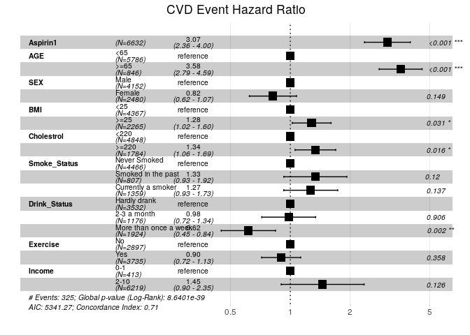<!-- -->

### 2.3 CCI 보정

``` r
dependent.cox3 <- coxph(Surv(START, STOP, CVD1)~Aspirin1+CCI_Score, data=data.dep2)
summary(dependent.cox3)
```

    ## Call:
    ## coxph(formula = Surv(START, STOP, CVD1) ~ Aspirin1 + CCI_Score, 
    ##     data = data.dep2)
    ## 
    ##   n= 6632, number of events= 325 
    ## 
    ##             coef exp(coef) se(coef)     z Pr(>|z|)    
    ## Aspirin1  1.1087    3.0304   0.1344 8.249   <2e-16 ***
    ## CCI_Score 0.4447    1.5601   0.0499 8.914   <2e-16 ***
    ## ---
    ## Signif. codes:  0 '***' 0.001 '**' 0.01 '*' 0.05 '.' 0.1 ' ' 1
    ## 
    ##           exp(coef) exp(-coef) lower .95 upper .95
    ## Aspirin1       3.03      0.330     2.329     3.944
    ## CCI_Score      1.56      0.641     1.415     1.720
    ## 
    ## Concordance= 0.701  (se = 0.015 )
    ## Likelihood ratio test= 171.2  on 2 df,   p=<2e-16
    ## Wald test            = 189.1  on 2 df,   p=<2e-16
    ## Score (logrank) test = 214.7  on 2 df,   p=<2e-16

``` r
ggforest(dependent.cox3,
         main = "CVD Event Hazard Ratio", 
         fontsize = 0.7, 
         refLabel = "reference", 
         noDigits = 2, 
         data=data.dep2)
```

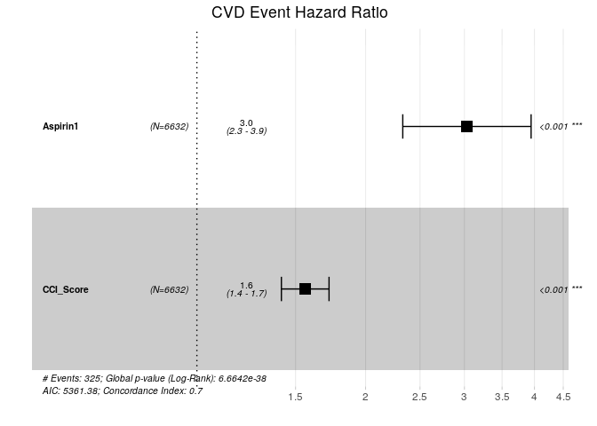<!-- -->

### 2.4 CCI + 건강검진 변수 보정

``` r
dependent.cox4 <- coxph(Surv(START, STOP, CVD1)~Aspirin1+CCI_Score+AGE+SEX+Income, data=data.dep2)
summary(dependent.cox4)
```

    ## Call:
    ## coxph(formula = Surv(START, STOP, CVD1) ~ Aspirin1 + CCI_Score + 
    ##     AGE + SEX + Income, data = data.dep2)
    ## 
    ##   n= 6632, number of events= 325 
    ## 
    ##                coef exp(coef) se(coef)      z Pr(>|z|)    
    ## Aspirin1    0.98462   2.67680  0.13568  7.257 3.96e-13 ***
    ## CCI_Score   0.37582   1.45619  0.05101  7.368 1.74e-13 ***
    ## AGE>=65     1.09090   2.97696  0.12449  8.763  < 2e-16 ***
    ## SEXFemale  -0.19092   0.82620  0.11672 -1.636    0.102    
    ## Income2-10  0.33600   1.39934  0.24410  1.376    0.169    
    ## ---
    ## Signif. codes:  0 '***' 0.001 '**' 0.01 '*' 0.05 '.' 0.1 ' ' 1
    ## 
    ##            exp(coef) exp(-coef) lower .95 upper .95
    ## Aspirin1      2.6768     0.3736    2.0518     3.492
    ## CCI_Score     1.4562     0.6867    1.3176     1.609
    ## AGE>=65       2.9770     0.3359    2.3324     3.800
    ## SEXFemale     0.8262     1.2104    0.6573     1.039
    ## Income2-10    1.3993     0.7146    0.8673     2.258
    ## 
    ## Concordance= 0.74  (se = 0.014 )
    ## Likelihood ratio test= 240.2  on 5 df,   p=<2e-16
    ## Wald test            = 281.7  on 5 df,   p=<2e-16
    ## Score (logrank) test = 330.2  on 5 df,   p=<2e-16

``` r
ggforest(dependent.cox4,
         main = "CVD Event Hazard Ratio", 
         fontsize = 0.7, 
         refLabel = "reference", 
         noDigits = 2, 
         data=data.dep2)
```

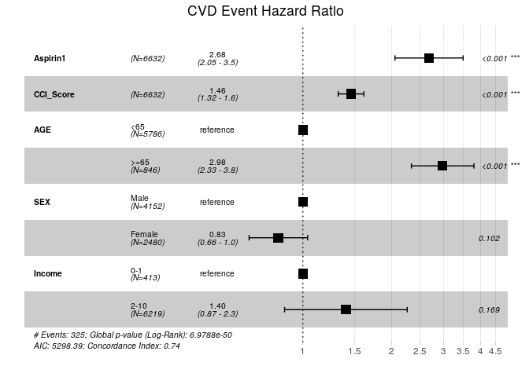<!-- -->

``` r
dependent.cox4_2 <- coxph(Surv(START, STOP, CVD1)~Aspirin1+CCI_Score+Aspirin1+AGE+SEX+BMI+Cholestrol+Smoke_Status+Drink_Status+Exercise+Income, data=data.dep2)
summary(dependent.cox4_2)
```

    ## Call:
    ## coxph(formula = Surv(START, STOP, CVD1) ~ Aspirin1 + CCI_Score + 
    ##     Aspirin1 + AGE + SEX + BMI + Cholestrol + Smoke_Status + 
    ##     Drink_Status + Exercise + Income, data = data.dep2)
    ## 
    ##   n= 6632, number of events= 325 
    ## 
    ##                                       coef exp(coef) se(coef)      z Pr(>|z|)
    ## Aspirin1                           0.94126   2.56320  0.13662  6.889 5.60e-12
    ## CCI_Score                          0.36782   1.44459  0.05133  7.166 7.75e-13
    ## AGE>=65                            1.08486   2.95902  0.12921  8.396  < 2e-16
    ## SEXFemale                         -0.23869   0.78766  0.13863 -1.722  0.08511
    ## BMI>=25                            0.18254   1.20027  0.11504  1.587  0.11257
    ## Cholestrol>=220                    0.29345   1.34105  0.11987  2.448  0.01436
    ## Smoke_StatusSmoked in the past     0.29736   1.34630  0.18567  1.602  0.10926
    ## Smoke_StatusCurrently a smoker     0.24401   1.27635  0.15842  1.540  0.12351
    ## Drink_Status2-3 a month            0.03047   1.03094  0.15973  0.191  0.84870
    ## Drink_StatusMore than once a week -0.44793   0.63895  0.16068 -2.788  0.00531
    ## ExerciseYes                       -0.07255   0.93002  0.11578 -0.627  0.53089
    ## Income2-10                         0.36538   1.44106  0.24453  1.494  0.13512
    ##                                      
    ## Aspirin1                          ***
    ## CCI_Score                         ***
    ## AGE>=65                           ***
    ## SEXFemale                         .  
    ## BMI>=25                              
    ## Cholestrol>=220                   *  
    ## Smoke_StatusSmoked in the past       
    ## Smoke_StatusCurrently a smoker       
    ## Drink_Status2-3 a month              
    ## Drink_StatusMore than once a week ** 
    ## ExerciseYes                          
    ## Income2-10                           
    ## ---
    ## Signif. codes:  0 '***' 0.001 '**' 0.01 '*' 0.05 '.' 0.1 ' ' 1
    ## 
    ##                                   exp(coef) exp(-coef) lower .95 upper .95
    ## Aspirin1                             2.5632     0.3901    1.9611    3.3502
    ## CCI_Score                            1.4446     0.6922    1.3063    1.5975
    ## AGE>=65                              2.9590     0.3379    2.2970    3.8118
    ## SEXFemale                            0.7877     1.2696    0.6003    1.0336
    ## BMI>=25                              1.2003     0.8331    0.9580    1.5038
    ## Cholestrol>=220                      1.3410     0.7457    1.0603    1.6962
    ## Smoke_StatusSmoked in the past       1.3463     0.7428    0.9356    1.9372
    ## Smoke_StatusCurrently a smoker       1.2764     0.7835    0.9357    1.7411
    ## Drink_Status2-3 a month              1.0309     0.9700    0.7538    1.4099
    ## Drink_StatusMore than once a week    0.6390     1.5651    0.4663    0.8755
    ## ExerciseYes                          0.9300     1.0752    0.7412    1.1669
    ## Income2-10                           1.4411     0.6939    0.8924    2.3272
    ## 
    ## Concordance= 0.75  (se = 0.014 )
    ## Likelihood ratio test= 261.4  on 12 df,   p=<2e-16
    ## Wald test            = 301.4  on 12 df,   p=<2e-16
    ## Score (logrank) test = 350.7  on 12 df,   p=<2e-16

``` r
ggforest(dependent.cox4_2,
         main = "CVD Event Hazard Ratio", 
         fontsize = 0.7, 
         refLabel = "reference", 
         noDigits = 2, 
         data=data.dep2)
```

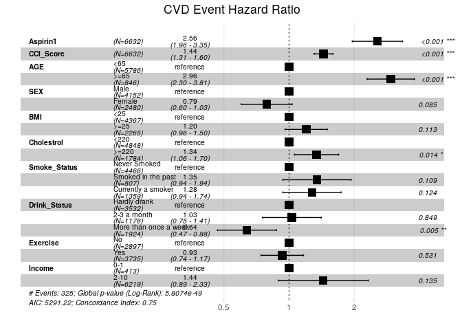<!-- -->

``` r
#fit <- survfit(dependent.cox4_2, newdata = data.dep2)
#ggsurvplot(fit, conf.int = TRUE, data=data.dep2)
```

## 3\. Subgrou Analysis (HTN, DM, DL)

### 3.0 HTN, DM, DL 이 선행논문처럼 event를 높이는지..? (Only Check)

``` r
coxph(Surv(START, STOP, HTN)~Aspirin1, data=data.dep2)
```

    ## Call:
    ## coxph(formula = Surv(START, STOP, HTN) ~ Aspirin1, data = data.dep2)
    ## 
    ##             coef exp(coef) se(coef)     z      p
    ## Aspirin1 0.90138   2.46301  0.05459 16.51 <2e-16
    ## 
    ## Likelihood ratio test=238.1  on 1 df, p=< 2.2e-16
    ## n= 6632, number of events= 1770

``` r
coxph(Surv(START, STOP, DM)~Aspirin1, data=data.dep2)
```

    ## Call:
    ## coxph(formula = Surv(START, STOP, DM) ~ Aspirin1, data = data.dep2)
    ## 
    ##             coef exp(coef) se(coef)     z      p
    ## Aspirin1 0.74995   2.11689  0.07447 10.07 <2e-16
    ## 
    ## Likelihood ratio test=89.8  on 1 df, p=< 2.2e-16
    ## n= 6632, number of events= 1010

``` r
coxph(Surv(START, STOP, DL)~Aspirin1, data=data.dep2)
```

    ## Call:
    ## coxph(formula = Surv(START, STOP, DL) ~ Aspirin1, data = data.dep2)
    ## 
    ##             coef exp(coef) se(coef)     z        p
    ## Aspirin1 0.46480   1.59170  0.05718 8.129 4.31e-16
    ## 
    ## Likelihood ratio test=60.59  on 1 df, p=7.014e-15
    ## n= 6632, number of events= 1891

### 3.1 Hypertension

``` r
HTN0 <- data.dep2[data.dep2$HTN==0,]
HTN1 <- data.dep2[data.dep2$HTN==1,]

HTN.fit0 <- survfit(Surv(START, STOP, CVD1)~Aspirin1, data=HTN0)
ggsurvplot(HTN.fit0, 
           risk.table = TRUE, risk.table.col = "strata",
           fun = "cumhaz", palette="nejm",
           legend.labs = c("No Aspirin User", "Aspirin User"), submain="CVD Event with/without Aspirin") +
  theme_survminer(font.submain=c(15, "bold.italic", "black"),
                  font.x = c(14, "bold.italic", "black"),
                  font.y = c(14, "bold.italic", "black"))
```

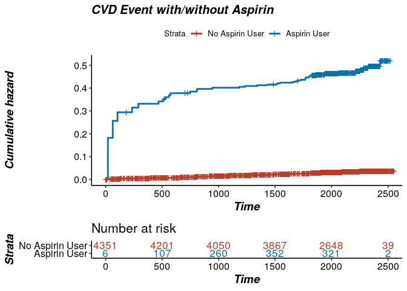<!-- -->

``` r
HTN.cox0 <- coxph(Surv(START, STOP, CVD1)~Aspirin1, data=HTN0)

summary(HTN.cox0)
```

    ## Call:
    ## coxph(formula = Surv(START, STOP, CVD1) ~ Aspirin1, data = HTN0)
    ## 
    ##   n= 4862, number of events= 174 
    ## 
    ##            coef exp(coef) se(coef)     z Pr(>|z|)    
    ## Aspirin1 1.7165    5.5652   0.1843 9.314   <2e-16 ***
    ## ---
    ## Signif. codes:  0 '***' 0.001 '**' 0.01 '*' 0.05 '.' 0.1 ' ' 1
    ## 
    ##          exp(coef) exp(-coef) lower .95 upper .95
    ## Aspirin1     5.565     0.1797     3.878     7.987
    ## 
    ## Concordance= 0.588  (se = 0.016 )
    ## Likelihood ratio test= 65.73  on 1 df,   p=5e-16
    ## Wald test            = 86.74  on 1 df,   p=<2e-16
    ## Score (logrank) test = 109.1  on 1 df,   p=<2e-16

``` r
ggforest(HTN.cox0,
         main = "CVD Event Hazard Ratio", 
         fontsize = 0.7, 
         refLabel = "reference", 
         noDigits = 2, 
         data=data.dep2)
```

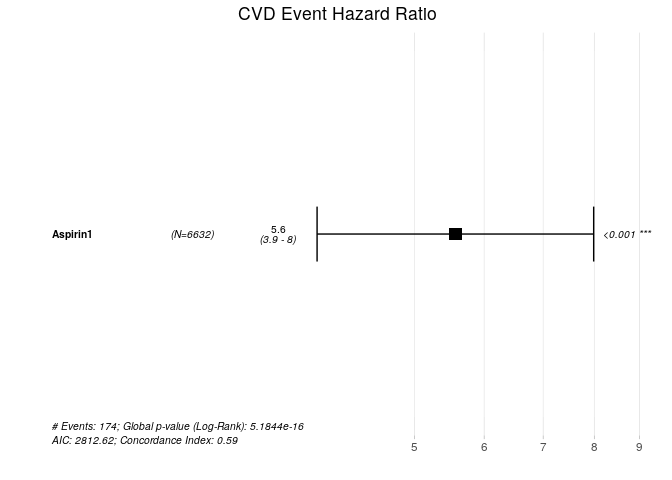<!-- -->

``` r
HTN.fit1 <- survfit(Surv(START, STOP, CVD1)~Aspirin1, data=HTN1)
ggsurvplot(HTN.fit1, 
           risk.table = TRUE, risk.table.col = "strata",
           fun = "cumhaz", palette="nejm",
           legend.labs = c("No Aspirin User", "Aspirin User"), submain="CVD Event with/without Aspirin") +
  theme_survminer(font.submain=c(15, "bold.italic", "black"),
                  font.x = c(14, "bold.italic", "black"),
                  font.y = c(14, "bold.italic", "black"))
```

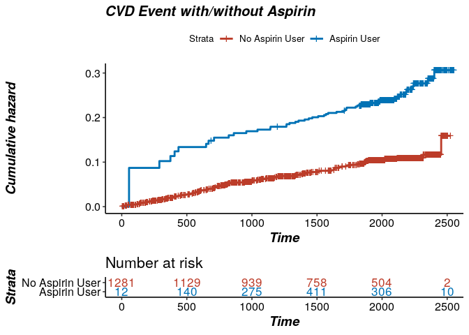<!-- -->

``` r
HTN.cox1 <- coxph(Surv(START, STOP, CVD1)~Aspirin1, data=HTN1)

summary(HTN.cox1)
```

    ## Call:
    ## coxph(formula = Surv(START, STOP, CVD1) ~ Aspirin1, data = HTN1)
    ## 
    ##   n= 1770, number of events= 151 
    ## 
    ##            coef exp(coef) se(coef)     z Pr(>|z|)   
    ## Aspirin1 0.5339    1.7055   0.1918 2.783  0.00538 **
    ## ---
    ## Signif. codes:  0 '***' 0.001 '**' 0.01 '*' 0.05 '.' 0.1 ' ' 1
    ## 
    ##          exp(coef) exp(-coef) lower .95 upper .95
    ## Aspirin1     1.705     0.5863     1.171     2.484
    ## 
    ## Concordance= 0.538  (se = 0.017 )
    ## Likelihood ratio test= 7.36  on 1 df,   p=0.007
    ## Wald test            = 7.75  on 1 df,   p=0.005
    ## Score (logrank) test = 7.89  on 1 df,   p=0.005

``` r
ggforest(HTN.cox1,
         main = "CVD Event Hazard Ratio", 
         fontsize = 0.7, 
         refLabel = "reference", 
         noDigits = 2, 
         data=data.dep2)
```

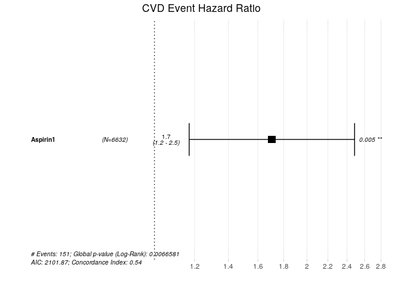<!-- -->

### 3.2 Diabetes Mellitus

``` r
DM0 <- data.dep2[data.dep2$DM==0,]
DM1 <- data.dep2[data.dep2$DM==1,]

DM.fit0 <- survfit(Surv(START, STOP, CVD1)~Aspirin1, data=DM0)
ggsurvplot(DM.fit0, 
           risk.table = TRUE, risk.table.col = "strata",
           fun = "cumhaz", palette="nejm",
           legend.labs = c("No Aspirin User", "Aspirin User"), submain="CVD Event with/without Aspirin") +
  theme_survminer(font.submain=c(15, "bold.italic", "black"),
                  font.x = c(14, "bold.italic", "black"),
                  font.y = c(14, "bold.italic", "black"))
```

<!-- -->

``` r
DM.cox0 <- coxph(Surv(START, STOP, CVD1)~Aspirin1, data=DM0)

summary(DM.cox0)
```

    ## Call:
    ## coxph(formula = Surv(START, STOP, CVD1) ~ Aspirin1, data = DM0)
    ## 
    ##   n= 5622, number of events= 238 
    ## 
    ##            coef exp(coef) se(coef)     z Pr(>|z|)    
    ## Aspirin1 1.6077    4.9912   0.1549 10.38   <2e-16 ***
    ## ---
    ## Signif. codes:  0 '***' 0.001 '**' 0.01 '*' 0.05 '.' 0.1 ' ' 1
    ## 
    ##          exp(coef) exp(-coef) lower .95 upper .95
    ## Aspirin1     4.991     0.2004     3.684     6.762
    ## 
    ## Concordance= 0.589  (se = 0.014 )
    ## Likelihood ratio test= 85.93  on 1 df,   p=<2e-16
    ## Wald test            = 107.7  on 1 df,   p=<2e-16
    ## Score (logrank) test = 131.1  on 1 df,   p=<2e-16

``` r
ggforest(DM.cox0,
         main = "CVD Event Hazard Ratio", 
         fontsize = 0.7, 
         refLabel = "reference", 
         noDigits = 2, 
         data=data.dep2)
```

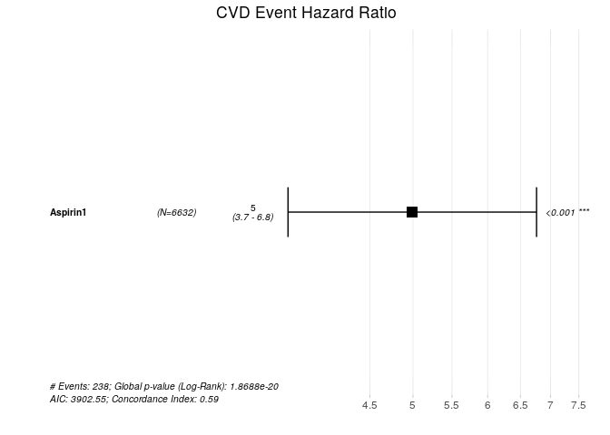<!-- -->

``` r
DM.fit1 <- survfit(Surv(START, STOP, CVD1)~Aspirin1, data=DM1)
ggsurvplot(DM.fit1, 
           risk.table = TRUE, risk.table.col = "strata",
           fun = "cumhaz", palette="nejm",
           legend.labs = c("No Aspirin User", "Aspirin User"), submain="CVD Event with/without Aspirin") +
  theme_survminer(font.submain=c(15, "bold.italic", "black"),
                  font.x = c(14, "bold.italic", "black"),
                  font.y = c(14, "bold.italic", "black"))
```

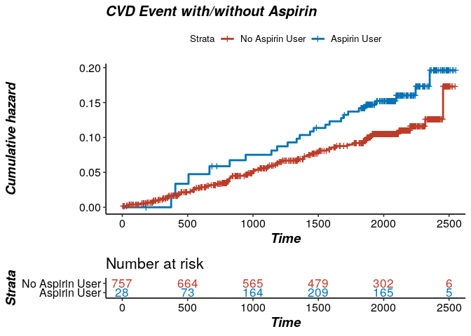<!-- -->

``` r
DM.cox1 <- coxph(Surv(START, STOP, CVD1)~Aspirin1, data=DM1)

summary(DM.cox1)
```

    ## Call:
    ## coxph(formula = Surv(START, STOP, CVD1) ~ Aspirin1, data = DM1)
    ## 
    ##   n= 1010, number of events= 87 
    ## 
    ##            coef exp(coef) se(coef)     z Pr(>|z|)
    ## Aspirin1 0.3901    1.4772   0.2513 1.553    0.121
    ## 
    ##          exp(coef) exp(-coef) lower .95 upper .95
    ## Aspirin1     1.477      0.677    0.9027     2.417
    ## 
    ## Concordance= 0.534  (se = 0.023 )
    ## Likelihood ratio test= 2.29  on 1 df,   p=0.1
    ## Wald test            = 2.41  on 1 df,   p=0.1
    ## Score (logrank) test = 2.44  on 1 df,   p=0.1

``` r
ggforest(DM.cox1,
         main = "CVD Event Hazard Ratio", 
         fontsize = 0.7, 
         refLabel = "reference", 
         noDigits = 2, 
         data=data.dep2)
```

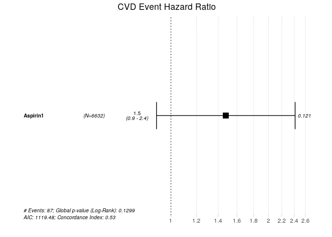<!-- -->

### 3.3 Dyslipidemia

``` r
DL0 <- data.dep2[data.dep2$DL==0,]
DL1 <- data.dep2[data.dep2$DL==1,]

DL.fit0 <- survfit(Surv(START, STOP, CVD1)~Aspirin1, data=DL0)
ggsurvplot(DL.fit0, 
           risk.table = TRUE, risk.table.col = "strata",
           fun = "cumhaz", palette="nejm",
           legend.labs = c("No Aspirin User", "Aspirin User"), submain="CVD Event with/without Aspirin") +
  theme_survminer(font.submain=c(15, "bold.italic", "black"),
                  font.x = c(14, "bold.italic", "black"),
                  font.y = c(14, "bold.italic", "black"))
```

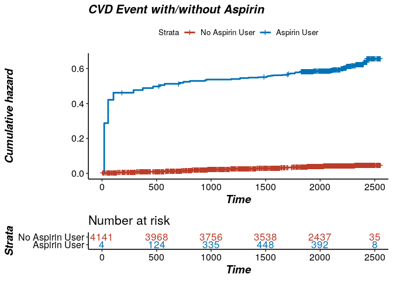<!-- -->

``` r
DL.cox0 <- coxph(Surv(START, STOP, CVD1)~Aspirin1, data=DL0)

summary(DL.cox0)
```

    ## Call:
    ## coxph(formula = Surv(START, STOP, CVD1) ~ Aspirin1, data = DL0)
    ## 
    ##   n= 4741, number of events= 200 
    ## 
    ##            coef exp(coef) se(coef)     z Pr(>|z|)    
    ## Aspirin1 1.3486    3.8520   0.1778 7.584 3.36e-14 ***
    ## ---
    ## Signif. codes:  0 '***' 0.001 '**' 0.01 '*' 0.05 '.' 0.1 ' ' 1
    ## 
    ##          exp(coef) exp(-coef) lower .95 upper .95
    ## Aspirin1     3.852     0.2596     2.718     5.458
    ## 
    ## Concordance= 0.566  (se = 0.014 )
    ## Likelihood ratio test= 45.94  on 1 df,   p=1e-11
    ## Wald test            = 57.51  on 1 df,   p=3e-14
    ## Score (logrank) test = 66.28  on 1 df,   p=4e-16

``` r
ggforest(DL.cox0,
         main = "CVD Event Hazard Ratio", 
         fontsize = 0.7, 
         refLabel = "reference", 
         noDigits = 2, 
         data=data.dep2)
```

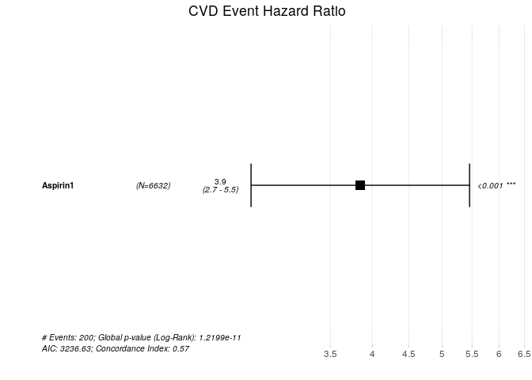<!-- -->

``` r
DL.fit1 <- survfit(Surv(START, STOP, CVD1)~Aspirin1, data=DL1)
ggsurvplot(DL.fit1, 
           risk.table = TRUE, risk.table.col = "strata",
           fun = "cumhaz", palette="nejm",
           legend.labs = c("No Aspirin User", "Aspirin User"), submain="CVD Event with/without Aspirin") +
  theme_survminer(font.submain=c(15, "bold.italic", "black"),
                  font.x = c(14, "bold.italic", "black"),
                  font.y = c(14, "bold.italic", "black"))
```

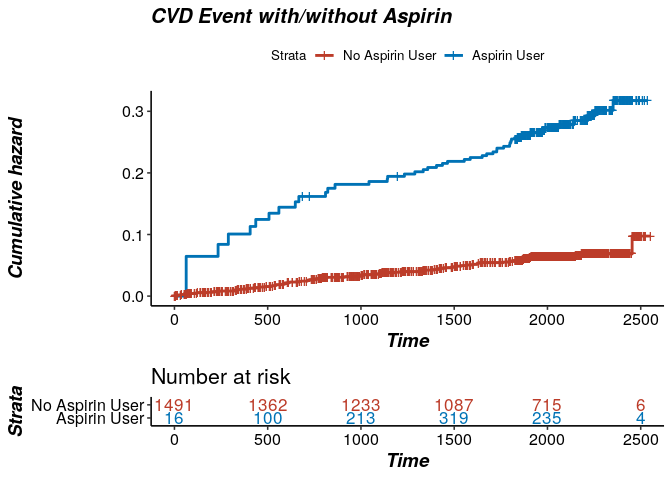<!-- -->

``` r
DL.cox1 <- coxph(Surv(START, STOP, CVD1)~Aspirin1, data=DL1)

summary(DL.cox1)
```

    ## Call:
    ## coxph(formula = Surv(START, STOP, CVD1) ~ Aspirin1, data = DL1)
    ## 
    ##   n= 1891, number of events= 125 
    ## 
    ##            coef exp(coef) se(coef)     z Pr(>|z|)    
    ## Aspirin1 1.2445    3.4713   0.2005 6.208 5.36e-10 ***
    ## ---
    ## Signif. codes:  0 '***' 0.001 '**' 0.01 '*' 0.05 '.' 0.1 ' ' 1
    ## 
    ##          exp(coef) exp(-coef) lower .95 upper .95
    ## Aspirin1     3.471     0.2881     2.343     5.142
    ## 
    ## Concordance= 0.597  (se = 0.02 )
    ## Likelihood ratio test= 34.2  on 1 df,   p=5e-09
    ## Wald test            = 38.54  on 1 df,   p=5e-10
    ## Score (logrank) test = 43.05  on 1 df,   p=5e-11

``` r
ggforest(DL.cox1,
         main = "CVD Event Hazard Ratio", 
         fontsize = 0.7, 
         refLabel = "reference", 
         noDigits = 2, 
         data=data.dep2)
```

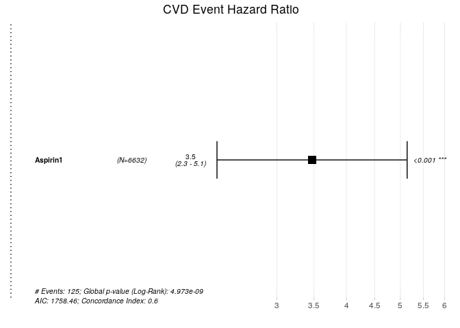<!-- -->

### 4.4 + HTN, DL, DM

``` r
dependent.cox5 <- coxph(Surv(START, STOP, CVD1)~Aspirin1+CCI_Score+HTN+DM+DL+Aspirin1+AGE+SEX+BMI+Cholestrol+Smoke_Status+Drink_Status+Exercise+Income, data=data.dep2)
summary(dependent.cox5)
```

    ## Call:
    ## coxph(formula = Surv(START, STOP, CVD1) ~ Aspirin1 + CCI_Score + 
    ##     HTN + DM + DL + Aspirin1 + AGE + SEX + BMI + Cholestrol + 
    ##     Smoke_Status + Drink_Status + Exercise + Income, data = data.dep2)
    ## 
    ##   n= 6632, number of events= 325 
    ## 
    ##                                       coef exp(coef) se(coef)      z Pr(>|z|)
    ## Aspirin1                           0.83217   2.29830  0.13935  5.972 2.34e-09
    ## CCI_Score                          0.31744   1.37361  0.05538  5.732 9.91e-09
    ## HTN                                0.46610   1.59376  0.13117  3.553  0.00038
    ## DM                                 0.02539   1.02572  0.14300  0.178  0.85907
    ## DL                                 0.06629   1.06854  0.12636  0.525  0.59985
    ## AGE>=65                            0.95975   2.61106  0.13500  7.109 1.17e-12
    ## SEXFemale                         -0.25120   0.77787  0.13887 -1.809  0.07046
    ## BMI>=25                            0.11440   1.12120  0.11641  0.983  0.32574
    ## Cholestrol>=220                    0.29823   1.34747  0.12006  2.484  0.01299
    ## Smoke_StatusSmoked in the past     0.30381   1.35501  0.18552  1.638  0.10150
    ## Smoke_StatusCurrently a smoker     0.28712   1.33259  0.15866  1.810  0.07034
    ## Drink_Status2-3 a month            0.02744   1.02782  0.15963  0.172  0.86352
    ## Drink_StatusMore than once a week -0.46386   0.62885  0.16113 -2.879  0.00399
    ## ExerciseYes                       -0.10135   0.90361  0.11631 -0.871  0.38352
    ## Income2-10                         0.34654   1.41417  0.24487  1.415  0.15701
    ##                                      
    ## Aspirin1                          ***
    ## CCI_Score                         ***
    ## HTN                               ***
    ## DM                                   
    ## DL                                   
    ## AGE>=65                           ***
    ## SEXFemale                         .  
    ## BMI>=25                              
    ## Cholestrol>=220                   *  
    ## Smoke_StatusSmoked in the past       
    ## Smoke_StatusCurrently a smoker    .  
    ## Drink_Status2-3 a month              
    ## Drink_StatusMore than once a week ** 
    ## ExerciseYes                          
    ## Income2-10                           
    ## ---
    ## Signif. codes:  0 '***' 0.001 '**' 0.01 '*' 0.05 '.' 0.1 ' ' 1
    ## 
    ##                                   exp(coef) exp(-coef) lower .95 upper .95
    ## Aspirin1                             2.2983     0.4351    1.7490    3.0201
    ## CCI_Score                            1.3736     0.7280    1.2323    1.5311
    ## HTN                                  1.5938     0.6274    1.2325    2.0610
    ## DM                                   1.0257     0.9749    0.7750    1.3575
    ## DL                                   1.0685     0.9359    0.8341    1.3688
    ## AGE>=65                              2.6111     0.3830    2.0040    3.4019
    ## SEXFemale                            0.7779     1.2856    0.5925    1.0212
    ## BMI>=25                              1.1212     0.8919    0.8925    1.4085
    ## Cholestrol>=220                      1.3475     0.7421    1.0649    1.7050
    ## Smoke_StatusSmoked in the past       1.3550     0.7380    0.9420    1.9492
    ## Smoke_StatusCurrently a smoker       1.3326     0.7504    0.9764    1.8186
    ## Drink_Status2-3 a month              1.0278     0.9729    0.7517    1.4054
    ## Drink_StatusMore than once a week    0.6289     1.5902    0.4586    0.8624
    ## ExerciseYes                          0.9036     1.1067    0.7194    1.1350
    ## Income2-10                           1.4142     0.7071    0.8751    2.2853
    ## 
    ## Concordance= 0.757  (se = 0.013 )
    ## Likelihood ratio test= 276.2  on 15 df,   p=<2e-16
    ## Wald test            = 313.6  on 15 df,   p=<2e-16
    ## Score (logrank) test = 368.8  on 15 df,   p=<2e-16

``` r
ggforest(dependent.cox5,
         main = "CVD Event Hazard Ratio", 
         fontsize = 0.7, 
         refLabel = "reference", 
         noDigits = 2, 
         data=data.dep2)
```

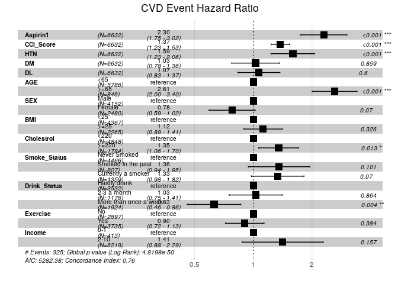<!-- -->

## 4\. 전체 HR

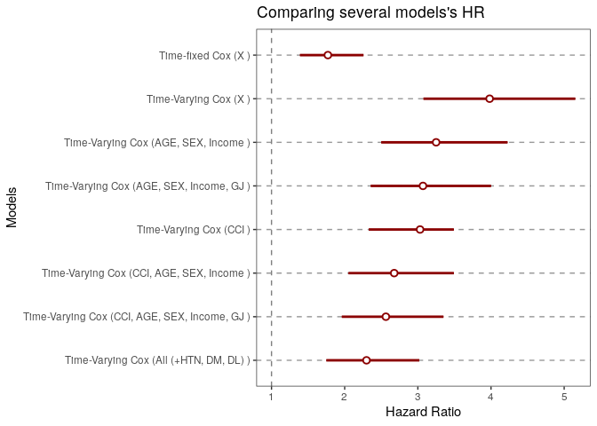<!-- -->

| label1           | label2                    | info                 |
| :--------------- | :------------------------ | :------------------- |
| Time-fixed Cox   | X                         | 1.771 (1.389, 2.257) |
| Time-Varying Cox | X                         | 3.981 (3.076, 5.152) |
| Time-Varying Cox | AGE, SEX, Income          | 3.25 (2.499, 4.226)  |
| Time-Varying Cox | AGE, SEX, Income, GJ      | 3.07 (2.356, 4)      |
| Time-Varying Cox | CCI                       | 3.03 (2.329, 3.492)  |
| Time-Varying Cox | CCI, AGE, SEX, Income     | 2.677 (2.052, 3.492) |
| Time-Varying Cox | CCI, AGE, SEX, Income, GJ | 2.563 (1.961, 3.35)  |
| Time-Varying Cox | All (+HTN, DM, DL)        | 2.298 (1.749, 3.02)  |
